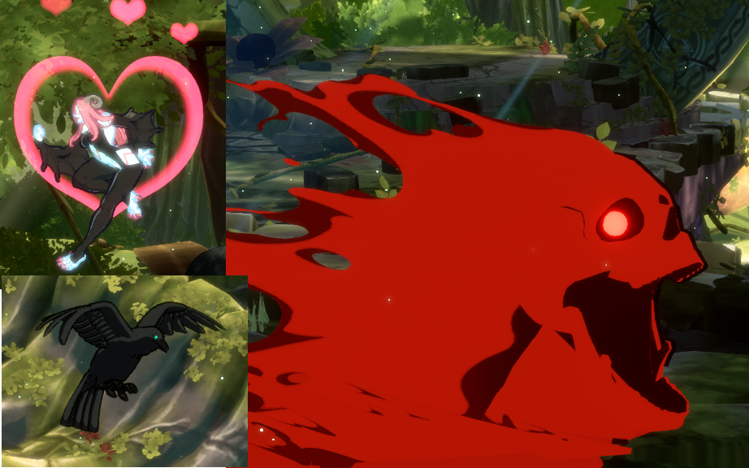

## What is the 'Backyard'?

In Guilty Gear lore, the _'Backyard'_ is described as:

> ...kind of a metaphysical command prompt. It's a realm of pure information, and all of that information makes up our collective reality - [TheGamer](https://www.thegamer.com/guilty-gear-the-backyard-explained/)

However Guilty Gear lore is a far more complicated than this entire project and is a rabbit-hole only delved into by the most dedicated or deranged of Guilty Gear enthusiast. For our purposes the _Backyard_ is a suite of tools that I created to visually analyse matches from _Guilty Gear -Strive-_ and attempt to further understand the factors involved in winning. It is the culmination of over a years worth of work and as far as I know it is the first of its kind, at least within fighting games. I am incredibly excited to share it with the community. In this blog, I would like to show the journey I undertook to deliver this and show the pitfalls along the way. In a follow up blog, I will reflect on the findings of the 'Backyard' and my opinion on its long-term viability. Before we begin, let me give a brief overview of the entire project.

### Guilty Gear -Strive-


_Two enter, only one may leave_

For the uninitiated (and frankly missing out) who are not familiar with the game in question, according to the Core-A fighting game family tree, _Guilty Gear -Strive-_ is an archetypal(traditional), 2D(2.5D), hold back to block, anime(air-dasher) fighting game.


_Credit: Core-A gaming_

What? You're still lost? Ok, let's try again. _Guilty Gear -Strive-_ is a 2D 1v1 fighting game where two players fight until either one of their characters is knocked out or time runs out. A character is knocked out once their **health** reaches 0. The standard format is a best-of 3, requiring a player to win two **rounds** before winning a **game**. Besides health, all characters have access to the resources **burst** and **tension** that allow them to perform additional powerful moves. We will dive deeper into specific mechanics as they come up.

> Note: Throughout the project you may see the word 'set' or 'match' used interchangeably with 'game'. Technically this is incorrect as 'set' or 'match' is a group of 'games' but I didn't realise this error to quite late in development. In the future this will be cleaned up but for now 'set', 'match' and 'game' are all synonymous. {: .prompt-warning }

### Backyard-Observer

_[Backyard-Observer](https://github.com/tmltsang/Backyard-Observer)_ main responsibility is training and utilising [YOLOv8](https://docs.ultralytics.com/) vision models for metrics gathering i.e. keeping track of the value of the numerous resources within the game.


_Backyard Observer visually classifying a game_

Based on the metrics gathered, it is also capable of predicting and visualising the winner of the current match in real-time, although this feature is still a proof-of-concept.


_'Real-Time' predictions'_

Check out the [README.md](https://github.com/tmltsang/Backyard-Observer/blob/main/README.md) if you'd like to know more.

### Backyard-Insight

**Backyard-Insight** is a dashboard hosted at [https://backyard-insight.info/](https://backyard-insight.info/) that visualises the metrics gathered by **Backyard-Observer**. The main dashboard features a graph that shows the likelihood of winning by each player at any point during the game. Above the graph is a facsimile of _Guilty Gear -Strive-'s_ UI, as you hover over the graph this will update and reflect the state of the game when the prediction was made. This can also serve as a historical record of the game. Additionally if the character Asuka is present, information about his 'spells' is also displayed, I will go into further details about this later on. The 'Game Stats' tab shows a comparison of some resource, such as burst and tension usage, between the two players.


_Nitro vs Tatuma at EVO Grand Finals_

Under 'Player Stats', a couple of tables of statistics are shown for each player. The top table shows the statistics, such as burst and tension usage, in each round or game. The bottom table is an aggregate of these statistics showing a players average usage per round or game, win or loss. By default it shows an aggregate across all matches however it can be grouped by character, tournament or tournament round.

### Notebooks

A series of Jupyter Notebooks via Google Colab were utilised for data exploration, data cleaning and training the machine learning models used for the win predictors. I will go over the interesting findings from these notebooks but feel free to read through them in full if you want to know more.

- [ggstrive.ipynb](https://colab.research.google.com/drive/1ybJt9Y1jr8Qtdvq8T515--zxLptH8D7v?usp=sharing) - Data exploration and machine learning model training for the Win Predictor.
- [ggstrive_asuka.ipynb](https://colab.research.google.com/drive/1HPtgk7gfxv6YQVEiv5CYf8RlGwLRczoV?usp=sharing) - Data exploration and machine learning model training for the Asuka Spell model.
- [ggstrive-Tournament.ipynb](https://colab.research.google.com/drive/1_gkzzw3t4O7hxUaud6jyS6_gkZBsgGU-?usp=sharing) - Data cleaning for tournament data.

## Origin

The idea was conceived, as all good ideas are, in frustration. As I bounced back and forth between Floor 8 and Floor 9 of the 'Tower', the rank system of _Guilty Gear -Strive-_, and struggled to climb the floors, I brainstormed ways I could improve ignoring the 'Training Room' and 'Replay Centre' menu option. Could I make a tool that compared my gameplay against that of top players and determine what actions influence winning? Maybe I could try machine learning, there are a multitude of library and resources. How hard could it be?[^footnote]

In all seriousness, I was also inspired by the sheer amount stats traditional sports have and how that improves the viewing experience. [DeepStrike](https://www.jabbr.ai/deepstrike) was just starting to gain recognition and its ability to track and represent the data autonomously using computer vision for combat sports, the closest traditional sport parallel to fighting games, was fascinating. At this time I didn't have a lot of expertise in the area but I wanted to see if I could provide a similar experience for e-sports.

### Investigation and Exploration

Initially I wanted to track every single action a character performed in match —movement, attacking, blocking, etc...— and see the difference in actions taken by low and high ranked players. In my case, that character would be my main, Testament. To help me get started with the computer vision, I first followed this incredibly helpful tutorial by [Learn Code by Gaming](https://learncodebygaming.com/blog/tutorial/opencv-object-detection-in-games).

It used **template matching** a technique where you try and find a **template image** on a larger **input image** by sliding the **template image** over the **input image** and comparing the similarity[^footnote-2]. Adapting this to my use case, is it possible to take the images of every move from [dustloop](https://www.dustloop.com/w/GGST) (the wiki of _Guilty Gear -Strive-_) as a template image and accurately determine if the move was used in a frame of a video. To start off with I would try **Testament's far slash**.

{: .w-50}
_Testament's far slash from dustloop_


_Testament's far slash found within a frame of a video with template matching_

Success! A green rectangle is drawn around a match with confidence over **0.85**. In the example above the output was `Best match confidence: 0.8679274916648865`. Let's try with a video now.


_Many false positives..._


_Those are some funny looking far slashes_

That's not good. It is completely unreliable. Clearly template matching is not going to cut it, let's try a more robust technique _feature detection and matching_ - a technique that detects and extracts features in the template image and attempts to match them in the input image. Typical features usually consist of edges, corners or any other interest points. In our case the edge of Testament's scythe and the edges of their cloak are potential features. Unfortunately this turned out to also be ineffective.


_Feature detection and matching_

The feature detection on the template looks fine but the feature matching is all over the place. It may have been possible to tweak some parameters to make this work more consistently however there was another looming issue, this was only a single frame from a single move. Testament has 5 attacks in standing, crouching and jumping position, command normals, special moves, overdrive, totalling to ~60 moves. That would mean for each frame, at minimum 60 sets of feature matching would need to be performed, that's not accounting for the fact that moves happen over multiple frames, at 60 fps (frames per second) this quickly becomes hundreds of images. Performance was going to be an issue and with less than promising accuracy efforts were better placed elsewhere.

## When in Doubt - YOLO

As I was doing some research I stumbled upon this video:


_Credit: River's Educational Channel_

In summary, they attempt to create a bot in the game the FPS (First Person Shooter) game Valorant with computer vision. [YOLO (You Only Look Once)](https://docs.ultralytics.com/) from Ultralytics was used for object detection. Usually training vision models would require vast amounts of labelled and annotated images. YOLO utilises **transfer learning** to solve this; by providing a model that was pre-trained on a large, general dataset, the heavy lifting has been done as the model understands images now just requiring fine-tuning for specific images greatly reducing the training time. To fine-tune the model, a dataset of appropriately labelled and annotated images is needed.

In the video the YOLO model is able to detect opponents on screen in real-time though although it failed to detect characters that were extremely close-up. This is not a common occurrence under normal gameplay and therefore there were no examples of it provided in the dataset. The issue with Valorant, a 3D tactical shooter, is that objects can be viewed from any angle or distance and finding numerous examples at these varying angles and distances can be tough.

In a 2D fighters such as Guilty Gear -Strive-, the camera is at a static angle and distance away from the characters, only panning left and right alleviating this issue entirely. YOLO seems like an ideal choice for my purposes. All that is needed is a dataset. Unfortunately there is no existing dataset for _Guilty Gear -Strive-_, so I'll need to obtain frames from gameplay footage and annotate them myself using the tool [labelimg](https://github.com/HumanSignal/labelImg).

###  Data Annotation - My Nightmare


_My life for weeks..._

I wanted to track a few key objects and actions:

Testament
: All actions associated with Testament, including movement, attacks and blocking


_A small sample of Testament's actions_

Objects associated with Testament
: This includes the crow, succubus and the skull projectile from Grave Reaper

_Top Left: Succubus, Bottom Left: Crow, Right: Skull from Grave Reaper_

Opponent
: Differentiating between Testament and any other character. Testament has also has a unique mechanic 'Stain' that they can apply to their opponent which is visually indicated by a 'purple' aura.


_Opponent with stain state_

System Mechanics
: All Bursts and Roman Cancels


_Left: Blue Psych Burst Right: Blue Roman cancel_

Each of these actions is defined as a **class** for YOLO and there are over 60+ of them to annotate and track. After a week, I was able to annotate around 200+ images and start training the vision model. However early results were not very promising.


_At least it tracks the crow..._

It's very quick but it's struggling to really identify Testament at all. Time to annotate more data...

In retrospect I have regrets about how I handled this. For me data annotation is truly a tedious, menial task and the diminished my optimism. The poor results created of negative feedback loop as I would begrudgingly annotate hundreds of images, train the model, be frustrated by any flaws and dread having to start the process again. Better structure and project planning could have helped here. I was hyper-focused on perfecting the vision model although an immensely important component, there were other aspects that could have been worked on. I knew vaguely that the final product consisted of training a vision model -> metric gathering -> visualisation. With more concrete definitions for each part, I could have tried to create a vertical slice. Instead of trying to create a vision model that could distinguish all of Testament's actions, create one that only accurately classified a single move and build the rest of the systems with that, similar to how software teams would 'mock' systems that aren't built yet. It would have given a realistic goal to aim for and the bulk of the annotation work could have been deferred to a point with a more mature project where the impact of the tedious task could have been reflected in the entire system, resulting in a more positive feedback loop.

The lack of planning also hurt as if you don't plan out all the classes you want to track, adding them in later can be painful. Multiple times I had to go back over hundreds of already annotated images, to annotate them again because there was a new class that needed to be added.

Besides annotation, the main breakthrough for accuracy was discovering the different [model sizes](https://docs.ultralytics.com/tasks/detect/#models). Up until this point I had been using the smallest size, YOLOv8n with only 2.6 params. **Params** is a measure of the number of weight and biases in a model, basically the number of components that can be tweaked. The higher the number, the larger and more complicated the model. Increasing this to the largest class, YOLOv8x with 68.2 params, improved the quality greatly.


_Tracks most of Testament's actions correctly_

This does comes with some consequences, there is an impact on performance in both training and running. While this is a lot better it's not quite accurate enough. I could keep annotating more images however I was starting an issue.


_Class Distribution of annotated images_

The top left of the graph shows the distribution of classes. As you can see there is a huge imbalance of examples of each class. This is expected to a degree, the two classes with huge spikes are 'Testament's Crow' and the 'Opponent' which are in almost every example but there are moves that rarely turn up. I've been obtaining frames by splitting up videos of high-level Testament matches from youtube. There is an inherent **selection bias** present in the matches as players have gravitate towards stronger moves causing the unequal distribution.

Regardless, with this model I attempted to make some visualisations. If I track the order of every single move a character does throughout the match it could then be represented as a **directed network graph**. Where every move is a node and where the edges could be weighted to show how often the source move led into the destination move.


_I did say 'attempt'_

I was not happy with the model nor the complete mess of the resulting visualisation. I could keep annotating images to hope that the accuracy improved to a point I was satisfied with however I realised something. Earlier on I had stated as my initial goal:

> Could I make a tool that compared my gameplay against that of top players and determine what actions influence winning?

Yet I had completely ignored the most fundamental part, who wins a match?

## Starting Over

This is the beginning of _Backyard Insight_ and _Observer_ as it is now. Instead of looking at the actions of a character on the screen, track the values of the different UI elements such as **gauges** and **system texts**. Those values can then be fed into a machine learning model that will predict the eventual game winner. The effects of different gauges on winning could then be examined. How important is **Tension** and **Burst** at different health values? The eventual goal would be to use this model to analyse tournament matches and provide a prediction through out the match in a manner similar to chess, where modern chess engines inspect the strength of the positions of each player.

{: .w-50}
_Bar on the left showing the strength of player positions_

To achieve this the following steps would need to be completed:

1. Annotate and create a dataset for a vision model
2. Train the vision model
3. Use the vision model to create a dataset for a predictive machine learning model
4. Train the predictive model
5. Run the vision model on tournament matches to create a tournament dataset
6. Use the predictive model on the tournament dataset
7. Create a dashboard from the prediction and tournament dataset

## Determining Classes to Track

Before the start of annotation, classes for the vision model needs to be determined. It wasn't clear exactly what would be needed down the line so as much as possible was tracked. This includes:


[Health](https://www.dustloop.com/w/GGST/Damage#Guts_and_Defense_Ratings)
: Also known as Life Gauge, the amount of remaining health that a character has, once this reaches 0 the character loses the round

Damaged
: If a player is currently being damaged, the healthbar will have a red segment on it.

[Burst](https://www.dustloop.com/w/GGST/Mechanics#Burst_Gauge)
: Used primarily for Psych Burst, a defensive option that consumes 100% Burst to interrupt and knock back an opponent. Starts at 100% at the beginning of a match and is the only gauge to be carried over between rounds. Season 2 added 'Wild Assault' and 'Deflect Shield' which both consume 50% Burst

[R.I.S.C.](https://www.dustloop.com/w/GGST/Damage#R.I.S.C._Level)
: A gauge that builds as a player blocks attacks. It depletes when a player is hit and they will take additional damage depending on how full the bar was

[Tension](https://www.dustloop.com/w/GGST/Mechanics#Tension_Gauge)
: The main 'resource' in Guilty Gear. Can be spent on a variety of offensive and defensive options. Most actions consume 50% tension which is marked by a 'gear' icon on the bar.

Round Count
: Represented by the hearts above the healthbar, become grey and broken when a round is lost


_Source: Dustloop[^footnote-4]_

[Counter](https://www.dustloop.com/w/GGST/Mechanics#Counter_Hit)
: Hitting an opponent before their recovery results in a powerful 'Counter' hit state

Reversal
: Performing an action immediately as they recover. Can be potent if combined with invincible moves

[Just/IB](https://www.dustloop.com/w/GGST/Mechanics#Instant_Block)
: IB stands for Instant Block. If a player blocks within 2 frames of their opponents attack, large 'JUST' text appears on screen and they are benefitted with an advantageous state

Punish
: If a player attacks their opponent during their recovery, the word 'Punish' will flash on their screen

{: .w-50}

Round Start
: Each round start with the same **Let's Rock** graphic.

{: .w-50}

Round End:
: Both 'Slash' and 'Perfect' screens can indicate the end of a round. Additionally the **Player 1** and **Player 2** text is also tracked

## My Recurring Nightmare - Data Annotation

I knew this would involve in making another YOLOv8 vision model for this but it should be easier this time. The gauges are UI elements and should be on screen at most times and this makes class distribution consistent. Each **gauge** is distinct in colour, location, appearance and take a signifiant portion of the screen. This should result in less annotated frames needed overall. Although the **system texts** are more situational, there is still an abundance of examples for most of them in a typical match.


_Class distribution from initial training_

The class distribution is much better resulting in good results early on. After the initial training I implemented an iterative process where I would, train a vision model -> Use the model to create labels on new frames -> Adjust any incorrect labels -> train the vision model with the new frames. This allowed me to quickly annotate frames at a much higher rate.


_Confusion Matrix during a later training_

The confusion matrix shows the actual class against the predicted class. An ideal matrix would only have points along the diagonal as that is where the actual class and predicted class intersect. In this model there are a few minor errors however they are primarily 'background', which is used when no prediction is made. This is not a big deal as the videos run at 60fps (frames per second) and missing the value of a gauge on a singular frame is not the end of the world.

## At Last... Data Collection

The next task was to use this vision model to record a match.

### Considerations

Data Format:
: The data format would need to be able represent every variable over the course of a match. This could be represented as a table, the columns are each variable and the rows are a specific point in time and saved to a CSV file.


```csv
time,p1_name,p2_name,p1_health,p2_health,p1_tension,p2_tension,...
...
17.4,aba,goldlewis,0.99863,0.10833,0.3231,0.48698,..
17.5,aba,goldlewis,0.99883,0.18119,0.32424,0.49,..
17.6,aba,goldlewis,0.99857,0.22916,0.3226,0.49,..
17.7,aba,goldlewis,0.99842,0.28257,0.33599,0.49,..
17.8,aba,goldlewis,0.99913,0.33827,0.34219,0.49,..
17.9,aba,goldlewis,0.99888,0.33886,0.38146,0.49,..
```
{: file='example.csv'}

Variables:
: There are two type of variables that need to be determined before training a predictive machine learning model, **features** or **input variables** and **target** or **output variables**. The **features** are variables that will predict or explain the **target**, otherwise known as the outcome. The machine learning model will try to find a relationship between the different features that best determines the target. In this case, features are relatively straight forward it's mainly composed of the value of each _gauge_ repeated for both players and the number of times an action with system text occurs e.g. counter hit, reversal...

#### Features

| Column Name     | Type      |                                                 Description |
| :-------------- | :-------- | ----------------------------------------------------------: |
| time            | `float`   |                               Time elapsed in current round |
| p1_name         | `string`  |                            Name of character in P1 position |
| p2_name         | `string`  |                            Name of character in P2 position |
| p1_health       | `float`   |           Percentage of health remaining for P1 between 0-1 |
| p2_health       | `float`   |           Percentage of health remaining for P2 between 0-1 |
| p1_tension      | `float`   |             Percentage of tension filled for P1 between 0-1 |
| p2_tension      | `float`   |             Percentage of tension filled for P2 between 0-1 |
| p1_burst        | `float`   |               Percentage of burst filled for P1 between 0-1 |
| p2_burst        | `float`   |               Percentage of burst filled for P2 between 0-1 |
| p1_risc         | `float`   |               Percentage of burst filled for P1 between 0-1 |
| p2_risc         | `float`   |               Percentage of burst filled for P2 between 0-1 |
| p1_round_count  | `int`     | Number of rounds won by P1 i.e. number of hearts lost by P2 |
| p2_round_count  | `int`     | Number of rounds won by P2 i.e. number of hearts lost by P1 |
| p1_counter      | `int`     |                        Number of 'Counters' performed by P1 |
| p2_counter      | `int`     |                        Number of 'Counters' performed by P2 |
| p1_just         | `int`     |                        Number of 'Just'/IBs performed by P1 |
| p2_just         | `int`     |                        Number of 'Just'/IBs performed by P2 |
| p1_punish       | `int`     |                          Number of Punishes performed by P1 |
| p2_punish       | `int`     |                          Number of Punishes performed by P2 |
| p1_reversal     | `int`     |                         Number of Reversals performed by P1 |
| p2_reversal     | `int`     |                         Number of Reversals performed by P2 |
| p1_curr_damaged | `boolean` |                            If P1 is currently being damaged |
| p2_curr_damaged | `boolean` |                            If P2 is currently being damaged |

#### Targets

The standard format for _Guilty Gear -Strive-_ (and most other fighting games) is played over a best of 3 'rounds' known as a 'game', although referred to 'set/match' in the project. While most gauges reset between rounds critically 'Burst' is actually carried over throughout the game i.e. if used in round 1 it may not be available for round 2. This necessitates 2 **target** variables, _Round Win_ and _Set Win_ and therefore most likely 2 machine learning models.

| Column Name  | Type      | Description               |
| ------------ | --------- | ------------------------- |
| p1_round_win | `boolean` | If P1 wins this round     |
| p1_set_win   | `boolean` | If P1 wins this match/set |

### Recording Data

To finally begin recording data the YOLOv8 output needs to be interpreted to the CSV data format detailed above. The pseduo-code looks for the logic looks like this:

```python
read YOLOv8 frame
if 'round_start' in frame: # Looking the round start graphic "Let's Rock"
  wait until 'round_start' disappears # This will be the first fame of the actual round
  update 'round_count' # Look at the number of hearts vs hearts broken in frame for each player
  initialise new 'round'
# Slash is the round end graphic time to determine winner
elif 'slash' in frame:
  #Determine winner from health values
  if p1_prev_health > p2_prev_health:
        winner = P1
  else:
        winner = P2
  round_history['round_winner'] = winner
  set_history.append(round_history)
  # round_count + 1 will be equivalent to number of rounds won at the end of a round
  if 'round_count' + 1 == 'max_round_count':
    set_history['set_winner'] = winner
    record_set_to_csv(set_history)
else:
  for each 'feature':
    if 'feature' in frame:
      current_round['feature'] = current frame value
    else:
      current_round['feature'] = previous frame value
  round_history.append(current_round)
```
{: file='bar_collection.py'}

This account for all fields in the CSV besides `p1_name` and `p2_name` which are manually set for each video via the filename. The full data collection can now begin. The videos were sourced from [GGST: High Level Gameplay](https://www.youtube.com/@GGHighLevel) totalling to about ~238 videos with a roughly equal character distribution. I started the process late at night, intending for it to complete over night. It kicked off processing 'aba' games, and slowly making its way down the list of videos in alphabetical order as I went to bed. Waking up, energised to finally see the results, it must be done or close to it. Checking the output, it was currently processing 'asuka'.... It was still on 'a', this might take a while.

I had severely underestimated how long this may take. At the current rate it may take more than a week. The average video length was ~10 minute and with 238 videos that equates to around 40hrs of videos to process. However the data collection runs slower than 'real-time' i.e. 60 frames-per-second. The main bottleneck was the the GPU, a 2080 with only 8GB of VRAM needed for the YOLO model. An easy way would be to skip frames as it's not necessary to process every single frame but what would be the appropriate amount of frames to skip? Fighting games rounds are not long, most not lasting longer than a minute; losing too much fidelity would be significantly detrimental to accuracy. In the end, every 6th frame or every 0.1 seconds, seemed to be the right balance of speed and fidelity. While the GPU will still be a bottleneck, looking back at the code, every action besides 'read YOLOv8 frame' uses the CPU. As the code is run sequentially/synchronously, any process using the CPU must wait till the GPU is done and vice versa, resulting in idle resources. Multi-processing can solve this. By running multiple processes in parallel and assigning a video to each, one process can use the GPU while the others can use the CPU. With this processing all the videos took ~2 days, roughly the real-time of the videos. Time to actually do something with the data.

## Training the predictors

While the data exploration and final outcomes are covered here ([ggstrive.ipynb](https://colab.research.google.com/drive/1ybJt9Y1jr8Qtdvq8T515--zxLptH8D7v?usp=sharing)) along with a greater explanation on the data format and eventual model I want to talk about the decisions and discoveries made along the way. There were two models that needed to be created the 'round predictor' and the 'set predictor'. Let's first look at the 'round predictor'.

### Feature Selection

During data collection many metrics were tracked that could be used however not all features are equal. It's usually a good idea to select the features will be most 'impactful' for predictions. What is considered impactful?

#### Data exploration

Doing some prelimnary graphing and comparing the different player's 'gauges', a clear trend is reveled.


_Shockingly the player with more health is more likely going to win_

x-axis is the value of the gauge for P1, likewise y-axis is the value for gauge for P2. Blue indicates a P1 win and Red indicates a P2 win. So there is more blue when P1 approaches 1.0 on the x-axis and vice versa. It's clear that health will be an important feature and will be selected however let's see if there is any other trends we can gather.


_P1 vs P2 for various gauges_

The tension graph is separated into 4 quadrants, this is due to how to implementation details of how tension was recorded visually however it becomes a useful side-effect when reviewing the graphs. Any action that uses _tension_ requires the player to have at least 0.5 (50%), therefore in the graph the top half and right half represent when P2 and P1 can utilise their tension respectively. Top right and bottom left quadrants are both equal states, both players either can or can not use tension. However in the top left where only P2 can use tension there is more red dots, indicating more P2 wins however and vice versa for bottom right and P1 wins.

_Burst_ and _R.I.S.C_ graphs seem to have no obvious trend. On top of that R.I.S.C has the vast majority of data points around 0. This is unsurprising for those familiar with the game however it does put into question whether it is a useful feature.

For the gauges _health_ is absolutely necessary, with _tension_ also looking useful but _burst_ and _R.I.S.C_ needs to be investigated further

#### Statistical Tests

In doing some research I came across _[aziztitu's football match predictor](https://github.com/aziztitu/football-match-predictor)_. A project that trained a model to predict football matches with a helpful write-up attached. In it they detail the statistical tests that they perform including Chi^2, VIF for collinearity and variance.

Chi^2 Test
: Chi^2 is a statistical test that evaluates how likely two categorical variables are independent by looking at any statistically significant differences in 'observed' vs 'expected' frequencies. For our case, we're looking to see if the observed frequencies deviate from the expected frequencies for a feature in a win compared to a loss. If the observed frequency and expected frequency are too similar, it indicates that the feature does not meaningfully inform us about the target, as its distribution can most likely be attributed to randomness. Conversely, if the frequencies deviate greatly on a win or loss, the results can not be explained by randomness and more the target is dependent on the feature, making it a useful predictor. Therefore the test is only useful for variables that are _categorical_ or _frequencies_ and the _gauges_ were **not** evaluated with this. (however it could have been possible if the gauge values were 'binned', i.e. put into buckets/groups of values.) This left the frequency of **system texts** and **currently damaged** to be evaluated.


_Results of Chi^2 test analysis_

The **damaged** feature is quite significant as well as **counter** hit, however the rest don't look too impactful. This intuitively makes sense, the player that is damaged more is likely going to lose and being 'counter' hit usually results in serious damage. For **punish** as the data collection was performed on high-level play, players at that skill level don't put themselves in position to be punished as often. If it was performed on 'low-mid' level player this would likely be much more significant feature. 'Just' is rare in general requiring an instant block a technique requiring a 2-frame input, there just wasn't a lot of examples for it. **Reversal** seems to not matter this only appears if a player performs a special move directly coming out of block stun or a knockdown but that's only useful in very specific situations.

Collinearity
: Using VIF (Variable Inflation Factor) each feature is checked for collinearity, that is how correlated two different features are. If two features are too similar, there is little reason to use both.

_VIF test output for features_

Although **p2_health** and **p1_burst** are in the 'removed features' section, it wouldn't make sense to remove a features only for a single player therefore these features would be kept. However it looks like **time** is highly collinear and will be removed.

Characters
: Character matchups are an essential part of any fighting game and should be essential to making an accurate prediction. Therefore `p1_name` and `p2_name` should be selected features. However after observing the results of some trained models the impact of the character choices seemed too significant. The likely reason for this is simply there wasn't enough variety of matches observed. *Guilty Gear -Strive-* has 28 characters totalling in a possible 784 different matchups. There were around 238 videos used mostly only covering a single matchup each. Of the matchups that were represented it would usually be the same handful of players in it. For example, the majority of I-No matches in the training set were played by Daru, a notable I-No specialist. The training set has a few samples of I-No and Sol, played by Mocchi. With such few examples about the dataset, would the results be indicative of the characters I-No vs Sol or the players Daru vs Mocchi? Looking even more broadly, are any results with I-No representative of the character or Daru's play? The goal was to see how **character** choice could influence the result, however with the small sample size it was difficult to separate **character** from **player** and therefore `p1_name` and `p2_name` were dropped.

The final feature list for the round predictor looks like:

| Column Name     |      Type |
| :-------------- | --------: |
| p1_health       |   `float` |
| p2_health       |   `float` |
| p1_tension      |   `float` |
| p2_tension      |   `float` |
| p1_burst        |   `float` |
| p2_burst        |   `float` |
| p1_counter      |     `int` |
| p2_counter      |     `int` |
| p1_curr_damaged | `boolean` |
| p2_curr_damaged | `boolean` |

### Training the round predictor

The models Gaussian Naive Bayes, Logistic Regression, Random Forest Classifier, Decision Tree Classifier and Multi-Layered Perceptron were trained and compared by their accuracy. Initially the results looked very promising:

```
gb fit
Accuracy: 0.6087470540909009
Precision: 0.6214640836619235
Recall: 0.6041636153352761
F1 Score: 0.6126917462675101
lr fit
Accuracy: 0.7034352339782644
Precision: 0.7025487766358092
Recall: 0.7301680294543967
F1 Score: 0.7160921874458254
rfc fit
Accuracy: 0.990182458809012
Precision: 0.9903052826111105
Recall: 0.9905303508568138
F1 Score: 0.9904178039475113
dtc fit
Accuracy: 0.6769395141157875
Precision: 0.67378067619532
Recall: 0.7159155761839586
F1 Score: 0.6942093715718539
```

{: file='ggstrive.ipynb'}

While all the results were fine there was a clear winner, 99% accuracy with the Random Forest Classifier. This is beyond my wildest expectations for this project, a near perfect predictor. Was it really possible to predict matches this accurately with only these few variables? Unfortunately, if it sounds too good to be true, it probably is.

### Overfitting

A lesson for myself, be careful of code that you copy. When learning how to create the dataset I took a bunch of code from various sources. There was one line I glossed over though:

```python
#Split the data
round_x_train, round_x_test, round_y_train, round_y_test = train_test_split(
    round_x, round_y, test_size=0.33, random_state=125
)
```

{: file='ggstrive.ipynb'}

Seemed innocent enough, it splits the data into training and testing data but `random_state=125` shuffled the data. The split should look like this:


With training and test data being distinct matches. However with the shuffle the test data was instead instances embedded in training data:


This caused overfitting to occur. For example, take these 3 data points:

| time     | p1_health | p2_health | p1_tension | p2_tension | p1_burst | p2_burst | p1_counter | p2_counter | p1_curr_damaged | p2_curr_damaged | p1_round_win |
| -------- | --------- | --------- | ---------- | ---------- | -------- | -------- | ---------- | ---------- | --------------- | --------------- | ------------ |
| Training | 10.2s     | 78.7      | 65.9       | 50.0       | 22.0     | 100      | 11.9       | 2          | 1               | True            | False        |
| Test     | 10.3s     | 76.0      | 65.9       | 50.5       | 23.0     | 100      | 12.2       | 2          | 1               | True            | False        |
| Training | 10.4s     | 75.5      | 65.9       | 50.1       | 24.0     | 100      | 12.5       | 2          | 1               | True            | False        |

The test data is situated in between the training data and its the all have similar values and the same target, **player 1 wins**. The point of the model is to find the relationship between all the features that can predict the 'target'. It does this iteratively constantly adjusting values, evaluated against the test data and then adjusting again. Since the training and evaluation is performed on essentially the same match, it becomes **overconfident** that the matches within the dataset are indicative of all matches. Eventually the model converges to almost match the dataset exactly resulting in 99% accuracy. It seems like Random Forest Classifier was especially adept at this being able to build a multitude of decision trees to match these specific datapoints. This is an almost textbook example of **overfitting** and it would be more correct to say that the model is recollecting the matches in the dataset rather than trying to predict the outcome. It is not indicative of how it will perform when viewing matches outside the dataset essentially making it useless. Simply removing the `random_state=125` solves the overfitting. The random forest classifier drops to 65% accuracy, still a good result but I can no longer believe that I had made a perfect model.

### Training the set predictor

This is mainly more of the same, I would highly recommend reading the notebook above if you're interested in more details however there is one notable thing to talk about. Determine the features was a little more challenging. **Burst** and the **round count** were the only features that persist between rounds however these features alone would not be able to determine the winner of a set, it would need to know what is happening in the current round. It didn't seem right to use the same features as the **round predictor**, now with an added round count. Instead the prediction from the **round predictor** was fed into the **set predictor**.

The final features for the **set predictor** are:

- `p1_burst`
- `p2_burst`
- `p1_round_count`
- `p2_round_count`
- `current_round_pred`
  - This is the result of the **round predictor** in the current game state

**Burst** is fed into both predictors but it's impact on a round and set are different.

After some hyper-parameter tuning the Multi-Layered Perceptron for both the round and set predictors was chosen moving forward. It's time to start looking at tournament matches...

## Asuka Arc

Although the results looked good, I wasn't fully satisfied by it. Especially after removing the character matchups from the features, the model seemed very generic only looking at a few UI elements. I wanted to see if there was something more character specific I could dive into and then I saw this:


_Credit: Sajam_

Sajam talks about the difficulty in commentating Asuka due to the sheer complexity of his spell mechanic. Asuka has 26 different unique spells and can hold up to 4 at any point. After using a spell he can draw more from a pool of 30 spells. Asuka's spells can be thought of as cards, the 4 on screen can be considered 'hand' that he plays and the pool would be his deck. Using the techniques I've learnt so far would there be a way to determine the quality of the currently held spells? I can't believe I scope creeped myself...

### Synthetic Frames

Investigating Asuka's Spells requires another vision model but I refuse to draw more boxes. There is the additional issue that some spells are used much more often than others leading to the a class distribution imbalance if I were to manually annotate game footage.


_Asuka and his spell in game_

Asuka's spells UI elements that are on screen at the same place at all times. **Synthetic frames** that mock Asuka's spell UI can be created by taking any frame of the game, even ones without Asuka, and overlaying random spells onto it in the correct location. Since overlaying the spell would be done pragmatically, the corresponding labels can be created for the YOLOv8 training thereby avoiding any need to annotate manually.


_Asuka Synthetic Frame, spells placed on screen with correct label_

Using this technique it was possible to create and have thousands of annotated frames almost instantaneously to use for training. This vastly sped up the process for training the model taking only a few days rather than the weeks and months of the previous models.

### Training the Asuka Spell Model

Full details of the training and model exploration are shown here If you are interested [ggstrive_asuka.ipynb](https://colab.research.google.com/drive/1HPtgk7gfxv6YQVEiv5CYf8RlGwLRczoV?usp=sharing). There are some interesting obstacles I want to highlight here.

Data Format
: The data obtained from the vision model and translated into the csv looked like this:

| asuka_spell_1  | asuka_spell_2  | asuka_spell_3 | asuka_spell_4          |
| -------------- | -------------- | ------------- | ---------------------- |
| howling_metron | howling_metron | go_to_marker  | bookmark_random_import |

Much like before, each row represents a point in time during the match and each column represents the spells as shown on the screen at the current moment, from left-right. The models don't know how to interpret string, therefore need to be encoded via one-hot encoder effectively turning each column into a binary vector of its possible values. The above example would become:

| asuka_spell_1_howling_metron | ...   | asuka_spell_2_howling_metron | ...   | asuka_spell_3_go_to_marker | ...   | asuka_spell_4_bookmark_random_import | ...   |
| :--------------------------: | ----- | :--------------------------: | ----- | :------------------------: | ----- | :----------------------------------: | ----- |
|              1               | 0...0 |              1               | 0...0 |             1              | 0...0 |                  1                   | 0...0 |

This inflates the number of columns from 4 to `4 * number of spells`. However the model should not care about the order of the spell as functionally the spells above in any other order is identical. It doesn't matter if any individual spell is in any specific column. To alleviate this issue, a custom encoder was created that converted the above format into:

| howling_metron | ...   | go_to_marker | ...   | bookmark_random_import | ...   |
| :------------: | ----- | :----------: | ----- | :--------------------: | ----- |
|       2        | 0...0 |      1       | 0...0 |           1            | 0...0 |

Each spell has its own column and the value becomes the number of spells seen on that frame.

Under Sampler
: Initial training of the models produced some interesting results:

```
gb fit
Accuracy: 0.6259795457564086
Precision: 0.7165239328155082
Recall: 0.7209271257765012
F1 Score: 0.7187187853765732
lr fit
Accuracy: 0.6673307654845708
Precision: 0.6738147405715351
Recall: 0.9654665686994857
F1 Score: 0.7936961177310417
rfc fit
Accuracy: 0.6576349227431708
Precision: 0.6926024481106972
Recall: 0.8692806091777436
F1 Score: 0.7709487278220432
dtc fit
Accuracy: 0.6675964050117325
Precision: 0.6778683445350112
Recall: 0.949903146082426
F1 Score: 0.79115438108484
mlp fit
Accuracy: 0.6702085270288219
Precision: 0.6817435005315551
Recall: 0.9423552200921782
F1 Score: 0.7911397728865834
```

{: file='ggstrive-asuka.ipynb'}

These are some strange results. The clue is in the consistently high **Recall** value. Recall is a measure of how well the model finds all instances of the positive class.

$$ Recall = {True Positive \over True Positive + False Negative} $$

The higher the **Recall** the lower the `False Negative` value. For that to happen either the model was extremely accurate or it rarely predicted a negative instance. For the latter to be true while maintaining a high accuracy, the test data must be overwhelmingly positive instances.

```
#Test Data
asuka_win
True	14971
False	7616
```

{: file='ggstrive-asuka.ipynb'}

This turns out to be the case not, a significant class imbalance for the positive class. This trend also holds true for the dataset as a whole. This introduces a bias to the predictions that should be avoided. This can be circumvented by utilising a Random Undersampler that will remove instances of the majority class.

```
#Test Data after Random Undersampler
True	7664
False	7600
```

{: file='ggstrive-asuka.ipynb'}

The training results then fall within expectations.

```
gb fit
Accuracy: 0.5914570230607966
Precision: 0.5843205574912892
Recall: 0.6543964620187305
F1 Score: 0.6173763651981838
lr fit
Accuracy: 0.5870020964360587
Precision: 0.5888318356867779
Recall: 0.5966441207075962
F1 Score: 0.5927122367230908
rfc fit
Accuracy: 0.5818265199161425
Precision: 0.5951582324631763
Recall: 0.5308272632674298
F1 Score: 0.561155036094878
dtc fit
Accuracy: 0.5721960167714885
Precision: 0.5572700296735905
Recall: 0.7328303850156087
F1 Score: 0.6331048432408136
mlp fit
Accuracy: 0.5906053459119497
Precision: 0.6004187020237265
Recall: 0.559573361082206
F1 Score: 0.5792769137547971
svc fit
Accuracy: 0.6072458071278826
Precision: 0.6116312804958459
Recall: 0.6032778355879292
F1 Score: 0.6074258398271233
```

{: file='ggstrive-asuka.ipynb'}

Training and results
: For the most part training was similar to how it was performed before although a [SVC (Support Vector Classifier)](https://scikit-learn.org/stable/modules/generated/sklearn.svm.SVC.html) was also evaluated. The accuracy for all models was on the lower side ~60% but that's not unexpected as only looking at spells was never going to be incredibly accurate. In the end the Multi-Layered Perceptron once again gave the best results. The model when given a hand of spells outputs its confidence, represented as a percentage, that Asuka will win. Generally this range is about 40% -> 60%. In isolation it's not intuitive to determine the quality of a hand compared to others. Instead all possible hands were evaluated by the model, ranked and a percentile created. This has the added benefit that precomputing all the hands allows all the results to be cached which allows much faster lookups and entirely skips the need to use the model at all.

## Evaluating Tournaments

If you remember at the very beginning of this, a list of tasks were defined:

1. Annotate and create a dataset for a vision model
2. Train the vision model
3. Use the vision model to create a dataset for a predictive machine learning model
4. Train the predictive model
5. Run the vision model on tournament matches to create a tournament dataset
6. Use the predictive model on the tournament dataset
7. Create a dashboard from the prediction and tournament dataset

At this stage, steps 1-5 have been completed with a small detour in creating a model for Asuka's spells as well. Analysing the tournament matches should be simple enough with the tools that have already been created. The vision and predictive model should work exactly like they did during the data collection phase as long as the tournament matches are similar to the videos used in the data set.


_Oh no..._

Did you catch that? If we go back to logic used in the data collection:

```python
read YOLOv8 frame
if 'round_start' in frame: # Looking the round start graphic "Let's Rock"
  wait until 'round_start' disappears # This will be the first fame of the actual round
  update 'round_count' # Look at the number of hearts vs hearts broken in frame for each player
  initialise new 'round'
...
```

{: file='bar_collection.py'}

The round started but where was the round start graphic? The videos that had been analysed up until this point were recorded in-game replays of raw match footage, a controlled environment only concerned with the gameplay. However production of a tournament is more dynamic, there are other aspects to focus on such as players, commentators or crowd reactions and showing the 'round start' graphic is not necessarily priority. This ends up being the case for the end of round 'Slash' graphic as well often cutting to player reactions of the match result. The solution for this was to build a fail-safe condition, based on the round count/hearts. The round count will only change if a player wins a round, and a heart on the top will go grey or a player wins the entire set and all hearts return to red:

```python
read YOLOv8 frame
if 'round_start' in frame: # Looking the round start graphic "Let's Rock"
  wait until 'round_start' disappears # This will be the first fame of the actual round
  update 'round_count' # Look at the number of hearts vs hearts broken in frame for each player
  initialise new 'round'
if current round count > previous round count:
  initialise new 'round'
if current round count == 0:
  initialise new 'set'
```

{: file='bar_collection.py'}
It sounds simple but the actual execution is much more involved. If you're interested the code is open sourced and can be found [here](https://github.com/tmltsang/Backyard-Observer/blob/main/observer/bar_collector.py).

### Data Cleaning

One of the downsides of using a vision-based model for reading gauges is that sometimes, for a small number of frames, the model would 'hallucinate' and see the gauge expand or shrink without any actual movement. To combat these random outliers, the median on a rolling window was applied to all the gauges in the tournament matches. There was balance that needed to be struck with the size of the window. A large window would catch outliers that lasted for more than a few frames however there would fidelity loss as it would delay the reporting on the actual movement of the gauge. In the end a window size of 5 seems to be optimal although some outliers still do exist.

**Raw data**

| time      | 20.1 | 20.2 | 20.3 | 20.4 | 20.5 | 20.6 | 20.7 | 20.8 | 20.9 |
| --------- | ---- | ---- | ---- | ---- | ---- | ---- | ---- | ---- | ---- |
| p1_health | 50.0 | 50.0 | 75.5 | 75.5 | 50.0 | 45.5 | 45.5 | 45.5 | 45.5 |

**After cleaning**

| time      | 20.1 | 20.2 | 20.3 | 20.4 | 20.5 | 20.6 | 20.7 | 20.8 | 20.9 |
| --------- | ---- | ---- | ---- | ---- | ---- | ---- | ---- | ---- | ---- |
| p1_health | 50.0 | 50.0 | 50.0 | 50.0 | 50.0 | 45.5 | 45.5 | 45.5 | 45.5 |

Should this have been applied to the training dataset during the predictive model training? Probably but the thought was with enough data any inaccurate outliers would be outweighed by correct data however if I continue working on this, it will be applied to new datasets.

### More Stats!

While the main point of collecting the data was to create a running prediction, it also is a **history** of the match. Using this history it is possible to extract other interesting stats from each match such as:

- Bursts used
- Burst Gauged used
- Tension used
- Time spent in the lead according to the predictor

Furthermore these stats were grouped and aggregated by player to show a breakdown of stats over many games.
These are created here, [ggstrive-Tournament.ipynb](https://colab.research.google.com/drive/1_gkzzw3t4O7hxUaud6jyS6_gkZBsgGU-?usp=sharing), in a pre-processing step to speed up the eventual dashboard.

## Almost there, Creating Visualisations

The dashboard hosted at https://backyard-insight.info/, with the source code at [backyard-insight](https://github.com/tmltsang/Backyard-Insight), is a **Plotly Dash** webapp created in python with a **MongoDB Atlas** backend host on **Render**. As someone with limited frontend experience it was the easiest way to build something quickly. The bulk of the work learning some CSS to replicate the UI elements of _Guilty Gear -Strive-_ for the prediction graph. Unfortunately it is not 'responsive' i.e. it does not resize itself well to smaller screens such as mobile or tablets. The limitation for this, besides my own skill, is the **Plotly** graph component itself does not work well with limited screen size.

## Conclusions
This was quite a journey, I appreciate everyone who made it through the entire blog and look forward to any questions you may have. In the follow-up blog I'll reflect on the outcomes of the 'Backyard' as well as talk about its potential future.

#### Footnotes

[^footnote]: https://en.wikipedia.org/wiki/Dunning%E2%80%93Kruger_effect
[^footnote-2]: https://docs.opencv.org/4.x/d4/dc6/tutorial_py_template_matching.html
[^footnote-3]: https://docs.opencv.org/3.4/db/d27/tutorial_py_table_of_contents_feature2d.html
[^footnote-4]: https://www.dustloop.com/
