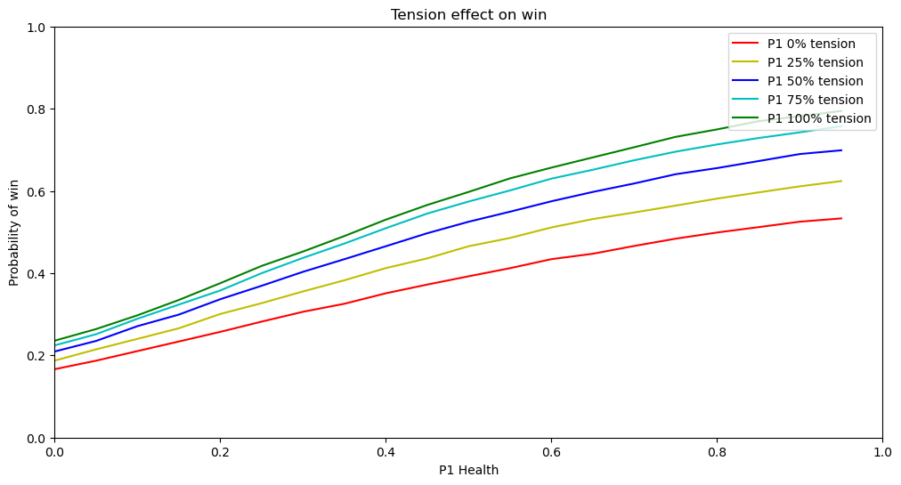
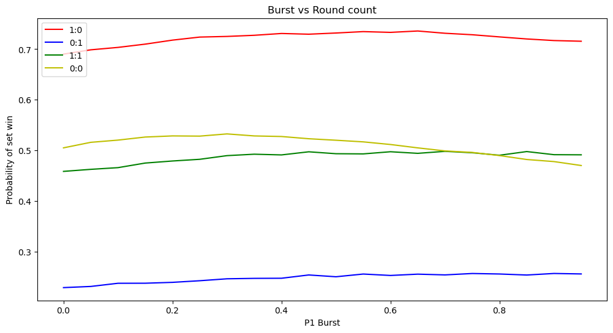
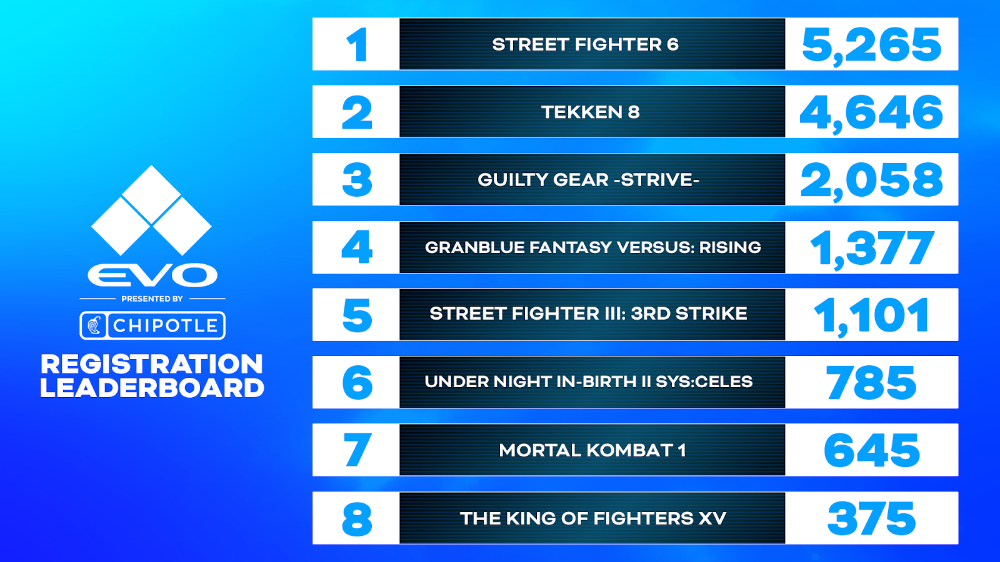

If you want a full picture of what the 'Backyard' is and the development behind it, I would suggest reading the preceding blogpost: 'The 'Backyard' Chronicles'. The 'Backyard' is very much a proof-of-concept meant to show how it's possible to use machine learning to obtain interesting statistics and visualistaions in the niche of fighting games. I want to take some time to reflect on the project, what I learnt along the way and how viable is it?

## What does the 'Backyard' tell us about *Guilty Gear -Strive-*?

_Tension and Health_

It took hundreds of engineering hours to basically tell us that the amount of 'health' a player has is the primary indicator of who wins. Since health is directly correleated with winning i.e. a round ends when a player reaches 0 health, health being the primary inidcator should not be as surprise. The reason to build out the rest of the model is to try and quantify exactly how favoured the player is to win. In the graph babove shows the relationship between a player's health at different tension values. What we see is expected, all the lines of tension follow roughly the same trends and ultimately the higher the tension and health, the higher the probability to win. A similar trend appears for other features, burst, damage and counters. However there is something interesting in the 'set/match' predictor.

_Burst and Round Count_

A match in *Guilty Gear -Strive-* consists of a best of 3. Therefore there can only be four states that the match can have, both players with 0 wins, both players with 1 win, either player 1 or player 2 have a win. This is represented in the label as `player wins:opponent wins`. The `0:0` and `1:1`
are both states where both players are equal and it wouldn't have been ridiculous to assume thath these lines would match but not only are they different, the `0:0` line has a **higher** predicted win percentage when `burst` is lower. That is counter-intuitive to what we've seen up until this point. There is an important point of distinction between `1:1` and `0:0`. When the game first starts at `0:0` both player always start with 100% burst. However going into `1:1` that is not always the case. The most prominent use of the burst bar is **Psych Burst** which requires 100% of the bar. It is possible for a player to never be able to **Psych Burst** in the `1:1` round and therefore it follows that having burst would result in a higher win percentage. On the other hand, in the `0:0` round both players would always have a chance to use **Psych Burst** therefore a 0% burst becomes synonymous with using a **Psych Burst** rather than not having burst. A similar trend can be seen in the `1:0` as only one more round win is needed, using a **Psych Burst** to secure a win is prefrable to holding it. So is the data telling us it's always better to use burst in the `0:0` round rather than hold it? It is important to remember that this model was only trained on matches of high ranking players which may introduce a bias to the results. Is it good to always burst at `0:0` or do high-ranking players only burst at oppurtune moments? At the moment I don't think that question is possible to answer with the limited dataset used here. I would be interested to see if the trend holds up if we were to greatly expand the dataset to explore more matches and more levels of play.

A similar phenomenon is seen with the **Asuka Spell** model. A quick rundown on how Asuka works, Asuka can hold a hand of up to 4 spells that he's free to cast or discard. Mana is required to cast these spells. After casitng, he can draw spells from three distinct polls of cards known as *Test Cases*. All Asuka's start on *Test Case 1* and most try to move to *Test Case 3* widely regarded as the strongest. Intuitively you would expect the lowest performing spell hands to be when Asuka can not cast any spells either if the hand is empty or he has no mana. Strangely enough the lowest performing spell hands are:

| asuka_spell_1          | asuka_spell_2                    | asuka_spell_3                    | asuka_spell_4                    | mlp_wr   | percentile |
| ---------------------- | -------------------------------- | -------------------------------- | -------------------------------- | -------- | ---------- |
| go_to_marker           | go_to_marker                     | shooting_time_stretch_decelerate | shooting_time_stretch_decelerate | 0.064763 | 0.000000   |
| go_to_marker           | shooting_time_stretch_decelerate | shooting_time_stretch_decelerate | shooting_time_stretch_decelerate | 0.076769 | 0.003178   |
| go_to_marker           | repulsive_rod_shooting           | shooting_time_stretch_decelerate | shooting_time_stretch_decelerate | 0.077910 | 0.006356   |
| go_to_marker           | gravity_rod_shooting             | shooting_time_stretch_decelerate | shooting_time_stretch_decelerate | 0.081878 | 0.009535   |
| bookmark_random_import | go_to_marker                     | shooting_time_stretch_decelerate | shooting_time_stretch_decelerate | 0.083777 | 0.012713   |
| go_to_marker           | no_mana                          | shooting_time_stretch_decelerate | shooting_time_stretch_decelerate | 0.088781 | 0.015891   |
| go_to_marker           | recover_mana_instant             | shooting_time_stretch_decelerate | shooting_time_stretch_decelerate | 0.090749 | 0.019069   |
| go_to_marker           | rms_boost_metron                 | shooting_time_stretch_decelerate | shooting_time_stretch_decelerate | 0.092661 | 0.022248   |
| repulsive_rod_shooting | repulsive_rod_shooting           | shooting_time_stretch_decelerate | shooting_time_stretch_decelerate | 0.101310 | 0.025426   |
| go_to_marker           | go_to_marker                     | metron_screamer_808              | shooting_time_stretch_decelerate | 0.101469 | 0.028604   |

**No mana** only features a single time in the bottom 10 hands. In fact the hand full of **No mana** is in the 1st percetile, ranked above ~330 other hands and the hand without spells is in the 48th percentile. Furthermore, there are many spell hands with spells missing that are higher in percentile:

| asuka_spell_1 | asuka_spell_2  | asuka_spell_3 | asuka_spell_4 | mlp_wr   | percentile |
| ------------- | -------------- | ------------- | ------------- | -------- | ---------- |
| go_to_marker  | used_spell     | used_spell    | used_spell    | 0.599523 | 73.642893  |
| go_to_marker  | howling_metron | used_spell    | used_spell    | 0.647833 | 82.888380  |

Only having a single **Go To Marker** has a much higher percentile than having two **Go To Marker** and  two **Shooting Time Stretch (Decelerate)**. Surely having any spell must be better than not. There is one disadvantage of a 'bad' spell as opposed to no spell. To draw a spell Asuka must perform the move [Bookmark](https://www.dustloop.com/w/GGST/Asuka_R#Bookmark). When performed on an empty spell slot it will draw a new spell however if instead performed on an existing spell slot it will **only** discard that spell. Asuka must then perform the move again to draw. While a tangible drawback, it is only a small cost and I don't think it explains the large disparity in percentile. More likely, similar to the burst, the empty spell slots have become synonymous with casting a spell and Asuka must be in an advantageous state to be able to cast spells and thereby **Empty/Used spells** become indicative of a win. In the specific case of **Go To Marker**, it is a spell in the strongest test case, *Test Case 3*, that is situational and therefore held onto for longer. While having only a **Go To Marker** spell is indicative of a win because of surrounding context, Asuka is in *Test Case 3* and has been able to use powerful spells, it conflicts with what I wanted from the model, to evaluate the 'strength' of Asuka's different hands in a vacuum. In other words it is predicting if Asuka wins with this hand rather than how strong is this hand. It would be hard to argue that just **go_to_marker** is better than `70%` of hands but Asuka's with this are likely to win. Is it really an issue to begin with? To be clear the model is not wrong, it is doing exactly what should have been expected of it and the results have been interesting to observe. To achieve the original goal more thought would be required.

## Computer Vision, the future?
In traditional, statistics are primarily still tracked by people. This has sometimes caused doubt and uncertainty about the validity of these statistics and requires the time of many people. Even with all the advances in the field, there's alot of difficulties that come with attempting this in traditional sports, no two people shoot a basketball, kick a football or swing a bat the same way. This is not the same with characters in a video game, they will always perform an action in the same way. It was never going to be feasable for me, as a solo developer, to obtain the metrics I needed manually therefore I looked to computer vision. In the end I only needed to keep track of large and distinct U.I. elements that are on-screen at almost all times. The whole project hinges on how accurate this vision model can be. It is time to reflect and evaluate if computer vision is viable for this task.

### Shortcomings

_Look closely as the model loses vision on 'Tension' on the bottom_

Low Gauge Values
: The model struggles to keep track when values are low in the tension gauge at the bottom and the burst bar after the **Psych Burst**. If you inspect the data on [backyard-insight](backyard-insight.info) closely, you'll see that the burst bar never truley goes to 0% because of this only reporing a values once it reaches around 8%.

False Negatives
: Sometimes, for whatever reason, the vision model will just lose track of an object for a frame. You can see the model 'flicker' as it tracks the tension gauge. This is partly because when training the model false negatives where preferred over false positives. We would rather not see the tension gauge rather than report the tension gauge as something else entirely. For the most part false negatives are easier to deal with, ignore the frame where you don't see the value. The trade-off is that it became hard to distinguish why the model had lost track of the object. Was it a false negative or did the value actually go to 0? This is compounded by the issues with low gauge values.

UI obscured
: This was not something I realised while playing the game but the characters and projectiles are actually in front of the UI and therefore block it fairly often. It happens a lot when characters jump and dash around the screen however the most egregious example is Asuka, when he casts some spells he creates essentially a wall that consistently obscures his health bar.

_Look at the bounding box jumping back and forth_

There is no way currently for the model to visually know if the bar has decreased legitimately or if it has been obscured.

Requires that the match is recorded
: Fighting game tournaments are quite unique compared to a lot of other e-sports. In other e-sports Large tournaments are generally invitationals for only a handful of top teams or players. Many of the major fighting game tournaments are open, anyone can sign-up and join. The longest-standing and most prestigous tournament Evo this year had 2,058 entrants in *Guilty Gear -Strive-* alone.

_16,252 entrants all up_

This requires an immense number of games to play to eventually crown a single champion. While there are multiple streams running all-day unfortunately not every match can be recorded. Without a recording there is no way to obtain the metrics.

### Strengths
Only requires a recording
: On the flipside, it only requires a recording. Using computer vision metrics can be gathered from any video of a match irrespective of patch version of if the game was played on PC or console. In fact, with some small adjustments to the code, it would still work from a phone or camera recording of the screen.

So the shortcomings look to outweigh the strengths here but let's look at the alternatives. The ideal solution would be for the game itself to report and expose these metrics, short of covertly infiltrating AcrSystem Works that is not realistic at the moment. The compromise is to create some sort of game mod that could expose these metrics, this will solve all the shortcomings about accuracy of metrics as obtaining them from the game directly should be reliable. Assuming this is possible via moddding, I haven't done enough research to say for sure, it would require the use of replay files. In *Guilty Gear -Strive-* replay files are a series of inputs that are played back in-game. This makes them unusable once the game is updated (although with some tedium it is possible to [downgrade verions](https://steamcommunity.com/sharedfiles/filedetails/?id=3047569482) if necessary). From a cultural perspetive, recording and sharing videos of gameplay is much more common then sharing replay files. For obtaining training data it might not be the biggest deal to source necessary replay files but how would this work for obtaining metrics from tournaments? If the tournament is played on console any solution involving mods is a moot point as they can not be installed. Even if the tournament is being played on PC, what tournament organiser is going to approve the installation of a random mod and also go through the trouble of making sure it is on every single setup at the event? If somehow, somewhere there was a tournament organiser that did approve of this, the metrics would either need to be sent to a server, requiring a connection to the internet that just complicates setups further or they would be saved locally and need to be gathered, which could be difficult depending on who owns the setup and risks having the data overwritten/deleted inadvertently.

Although there are concerns surrounding the accuracy of the computer vision model its strength can not be understated. Recording a video is by far the easiest and most common way that gameplay is shared. There is a world where obtaining accurate data for training does use a game mod in a controlled environment, the sheer amount of factors involved in tournaments makes it implausiable and computer vision for now seems like a necessity.

## How 'useful' is the 'Backyard'?
It was inevitable that someone would ask this question. In fact, in the previous blog post I also set out on this journey to see how I could improve my gameplay. Certainly at their current state, the preditive models should be considered a first draft and the results should always be taken with a grain of salt, issues with its accuracy have ben detailed above. But could they ever reach a state where meaning could be derived from the output? There is an issue that does make statistical discussion difficult in modern e-sports, the games are always evolving, a constant stream of balance changes and patches. As a relatively new field, most e-sports in games do not have much historical data to begin with making it even worse that the collected data could be invalidated on a six month cadence. In the case of the 'Backyard', the project started during Season 1 of *Guilty Gear -Strive-*, where the burst bar had only two uses **Psych or Gold Burst** both requiring 100% of the gauge. Season 2 released with 2 new uses for burst, **Wild Assualt** and **Deflection shield** both only requiring 50% of the gauge. Any model trained with matches from only Season 1 would likely become obsolete. Similarly when analysing Asuka's spell usage any change to any spells could severly impact the results of the Asuka spell model. Season 4 is about to release for *Guilty Gear -Strive-* and could potentially invalidate the predictions from the models. For now I would not hold my breath that 'Backyard' will at any time soon uncover some objective truth about how the game should be played. It should be considered entertainment, meant to add another dimension in the discussion of pro play for a bit of fun.

## Why?
It is an interesting question that I have been asked by many people over the course of development. From the outset was always going to be an immense undertaking for a solo project. Fighting games are a niche genre to begin with so this was never going to be lucrative. With the time and skillset I have at the moment, why not pursue something more beneficial?

I discovered the 'FGC' (Fighting Game Community) years ago when I was learning these skills in university and it kept me sane during some trying times. I coded weekly labs while I tuned into the NLBC. As I stressed about graph theory and matricies, I watched Justin Wong's legendary 2014 EVO UMVC3 run. I pulled all-nighters watching Excellent Adventures or the Rush Hour duo. As I fell deeper into the scene the quality I admired most was not the deft display of skills, clutch moments or incredible commentary. It was the **passion**. There is a lot of talented folks in the community who could have made more money elsewhere but the FGC has persisted and thrived out of the pure love for the games they play. As the first Capcom Cup happened finally the scene had been validated and now supported by the developers, and in years after the likes of ArcSys and Bandai Namco would follow suit. As I graduated and started working I'm not sure why, I stopped tuning in and as I worked more and more I was still lacking something. I had felt like I had never truly made anything and was becoming increasing disllusioned with my working situation. There were so many side-projects I thought about over the years and with one excuse or another I dismissed them.

Last year, I promised myself that I would commit and see a project through to the end. A few ideas bounced around in my head but I had recently fallen back into the FGC. I had always been a fascinated by machine learning and stats so why not combine them all and create something I actually cared about. It was by far the biggest project I was considering but once it crossed my mind, I could only think about the absolute passion that others had poured into the scene and it was now my chance, give back to a community that has given me so much. I almost gave up multiple times but Tokido said it best:



## What's next
At the very least, I do want to try and keep it up to date with tournaments as they happen. There is mulitple routes I could take this and I have not really decided which avenue I will pursue or when I will resume working on it.

Refine the current models
: Keep collecting and cleaning data to improve the accuracy of the current models.

Try and track character's actions
: If you read the previous blog post, this was what the idea was originally. One of the reasons I had dismissed it was because sourcing good examples of the moves was becoming difficult. However I'm hoping the way the techniques used to create the synthetic frames can be applied here as well.

Adapt this for a different game
: I'm curious to see if I could adapt this for Street Fighter 6. When I first started this project it had not been released yet but its drive system is quite unique and would be interesting to analyse.

I would be more than happy to answer any questions people have about this. Please feel free to contact me or leave a commnet.

